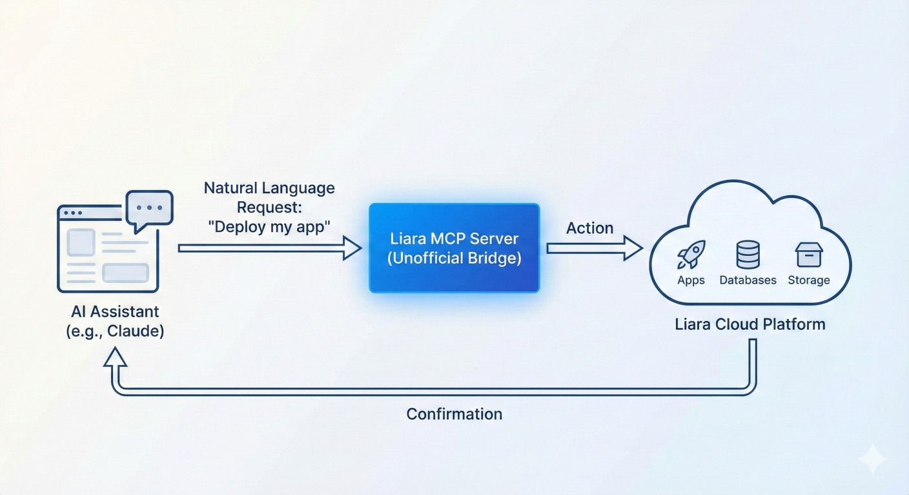

# Liara MCP Server

> **Note**: This is an **unofficial** MCP server for the Liara cloud platform. It is not affiliated with or endorsed by Liara.

A Model Context Protocol (MCP) server for the Liara cloud platform. This server enables AI assistants to deploy and manage applications, databases, and infrastructure on Liara through natural language.

<div align="center">
  
</div>

## Features

### Current Capabilities

- **App Management**: Create, deploy, start, stop, restart, and delete apps across 14+ platforms
- **Environment Variables**: Set and update environment variables for apps
- **Deployment**: Deploy releases, upload sources, rollback to previous versions
- **Database Management**: Create, manage, and backup databases (MySQL, PostgreSQL, MongoDB, Redis, etc.)
- **Object Storage**: Manage S3-compatible storage buckets and objects
- **DNS Management**: Complete DNS zone and record management
- **Domain Management**: Add, remove, and verify domains for apps
- **Disk Management**: Create and manage disks with FTP access
- **Mail Servers**: Create and manage mail servers, send emails
- **Virtual Machines (IaaS)**: Full VM lifecycle management with snapshots
- **Network Management**: Create and manage networks for VMs
- **Observability**: Retrieve app metrics and logs
- **Plans**: List and view available resource plans

### Supported Platforms

Node.js, Next.js, Laravel, PHP, Django, Flask, .NET, Static sites, React, Angular, Vue, Docker, Python, Go

### Supported Databases

MariaDB, MySQL, PostgreSQL, MSSQL, MongoDB, Redis, ElasticSearch, RabbitMQ

## Installation

```bash
npm install -g liara-mcp
```

Or use directly with npx (no installation required).

## Configuration

The server supports multiple ways to configure your API token:

### Option 1: Environment Variables (Recommended for MCP clients)

Set the token directly in your MCP client configuration (see Usage section below).

### Option 2: .env File (For local development)

1. Copy the example environment file:
```bash
cp .env.example .env
```

2. Configure your Liara API credentials in `.env`:
```
LIARA_API_TOKEN=your_api_token_here
LIARA_TEAM_ID=optional_team_id
LIARA_API_BASE_URL=https://api.iran.liara.ir
```

The server automatically loads `.env` files using dotenv, so no additional setup is required.

### Getting Your API Token

1. Go directly to the [API section](https://console.liara.ir/API) in Liara Console (or log in to [Liara Console](https://console.liara.ir) and navigate to the API section)
2. Select an expiration timeline for your API key (options: 1 hour, 1 day, 7 days, 1 month, 6 months, or 1 year)
3. Click "Create new key" (ساخت کلید جدید) to generate your API token
4. Copy the generated token immediately - it will only be shown once

### Team ID (Optional)

If you're working with a team account, you can find your Team ID in the API section of the Liara console when viewing your team.

## Usage

### With Claude Desktop / Cursor / VS Code

Add the following to your MCP configuration file:
- **Claude Desktop:** `~/Library/Application Support/Claude/claude_desktop_config.json` (macOS) or `%APPDATA%\Claude\claude_desktop_config.json` (Windows)
- **Cursor:** `.cursor/mcp.json`

```json
{
  "mcpServers": {
    "liara": {
      "command": "npx",
      "args": ["-y", "liara-mcp"],
      "env": {
        "LIARA_API_TOKEN": "your_api_token_here"
      }
    }
  }
}
```

### Troubleshooting: PATH Issues (nvm/nodenv users)

If you see `spawn npx ENOENT` error, run the setup wizard:

```bash
npx liara-mcp-setup
```

This will generate the correct configuration with absolute paths for your system.

### Available Tools

#### App Management
- `liara_list_apps` - List all apps
- `liara_get_app` - Get app details
- `liara_create_app` - Create a new app
- `liara_delete_app` - Delete an app
- `liara_start_app` - Start an app
- `liara_stop_app` - Stop an app
- `liara_restart_app` - Restart an app
- `liara_resize_app` - Change app plan

#### Environment Variables
- `liara_set_env_vars` - Set multiple environment variables
- `liara_set_env_var` - Set a single environment variable
- `liara_get_env_vars` - Get all environment variables
- `liara_delete_env_var` - Delete an environment variable
- `liara_delete_env_vars` - Delete multiple environment variables

#### Deployment
- `liara_upload_source` - Upload source code for deployment
- `liara_deploy_release` - Deploy a release
- `liara_list_releases` - List all releases
- `liara_get_release` - Get release details
- `liara_rollback_release` - Rollback to a previous release
- `liara_list_sources` - List uploaded sources
- `liara_delete_source` - Delete an uploaded source

#### Database Management
- `liara_list_databases` - List all databases
- `liara_get_database` - Get database details
- `liara_create_database` - Create a new database
- `liara_delete_database` - Delete a database
- `liara_start_database` - Start a database
- `liara_stop_database` - Stop a database
- `liara_restart_database` - Restart a database
- `liara_resize_database` - Change database plan
- `liara_get_database_connection` - Get database connection info
- `liara_create_backup` - Create a database backup
- `liara_list_backups` - List database backups
- `liara_get_backup_download_url` - Get backup download URL
- `liara_restore_backup` - Restore database from backup
- `liara_delete_backup` - Delete a database backup

#### Object Storage
- `liara_list_buckets` - List all buckets
- `liara_get_bucket` - Get bucket details
- `liara_create_bucket` - Create a new bucket
- `liara_delete_bucket` - Delete a bucket
- `liara_get_bucket_credentials` - Get S3 credentials for a bucket
- `liara_list_objects` - List objects in a bucket
- `liara_upload_object` - Upload an object to a bucket
- `liara_get_object_download_url` - Get download URL for an object
- `liara_delete_object` - Delete an object from a bucket
- `liara_get_object_metadata` - Get metadata for an object

#### App Settings
- `liara_set_zero_downtime` - Enable/disable zero-downtime deployment
- `liara_set_default_subdomain` - Enable/disable default subdomain
- `liara_set_fixed_ip` - Enable/disable static IP
- `liara_set_read_only` - Enable/disable read-only mode

#### Disk Management
- `liara_list_disks` - List disks for an app
- `liara_get_disk` - Get disk details
- `liara_create_disk` - Create a new disk
- `liara_delete_disk` - Delete a disk
- `liara_resize_disk` - Resize a disk
- `liara_create_ftp_access` - Create FTP access for a disk
- `liara_list_ftp_accesses` - List FTP accesses for a disk
- `liara_delete_ftp_access` - Delete FTP access

#### DNS Management
- `liara_list_zones` - List all DNS zones
- `liara_get_zone` - Get zone details
- `liara_create_zone` - Create a DNS zone
- `liara_delete_zone` - Delete a DNS zone
- `liara_check_zone` - Check zone status
- `liara_list_dns_records` - List DNS records
- `liara_create_dns_record` - Create a DNS record
- `liara_get_dns_record` - Get DNS record details
- `liara_update_dns_record` - Update a DNS record
- `liara_delete_dns_record` - Delete a DNS record

#### Domain Management
- `liara_list_domains` - List all domains
- `liara_get_domain` - Get domain details
- `liara_add_domain` - Add a domain to an app
- `liara_remove_domain` - Remove a domain from an app
- `liara_check_domain` - Check domain status

#### Mail Server
- `liara_list_mail_servers` - List all mail servers
- `liara_get_mail_server` - Get mail server details
- `liara_create_mail_server` - Create a mail server
- `liara_delete_mail_server` - Delete a mail server
- `liara_start_mail_server` - Start a mail server
- `liara_stop_mail_server` - Stop a mail server
- `liara_restart_mail_server` - Restart a mail server
- `liara_send_email` - Send an email

#### Virtual Machines (IaaS)
- `liara_list_vms` - List all VMs
- `liara_get_vm` - Get VM details
- `liara_create_vm` - Create a new VM
- `liara_start_vm` - Start a VM
- `liara_stop_vm` - Stop a VM
- `liara_restart_vm` - Restart a VM
- `liara_shutdown_vm` - Shutdown a VM
- `liara_poweroff_vm` - Power off a VM
- `liara_delete_vm` - Delete a VM
- `liara_resize_vm` - Resize a VM
- `liara_create_snapshot` - Create a VM snapshot
- `liara_list_snapshots` - List VM snapshots
- `liara_restore_snapshot` - Restore VM from snapshot
- `liara_delete_snapshot` - Delete a VM snapshot
- `liara_attach_network` - Attach network to VM
- `liara_detach_network` - Detach network from VM

#### Network Management
- `liara_list_networks` - List all networks
- `liara_get_network` - Get network details
- `liara_create_network` - Create a network
- `liara_delete_network` - Delete a network

#### Observability
- `liara_get_metrics` - Get app metrics
- `liara_get_logs` - Get app logs

#### Plans
- `liara_list_plans` - List available plans
- `liara_get_plan` - Get plan details

#### User
- `liara_get_user` - Get user information

## Examples

### Example Conversations

**Create and deploy an app:**
```
User: Create a Node.js app called "my-api" with the basic plan
Assistant: [Uses liara_create_app tool]

User: Set the NODE_ENV to production for my-api
Assistant: [Uses liara_set_env_var tool]

User: Start the app
Assistant: [Uses liara_start_app tool]
```

**Create a database:**
```
User: Create a PostgreSQL database called "my-db" with the starter plan
Assistant: [Uses liara_create_database tool]

User: Create a backup of my-db
Assistant: [Uses liara_create_backup tool]
```

**Manage storage:**
```
User: Create a bucket called "my-files"
Assistant: [Uses liara_create_bucket tool]

User: Get the S3 credentials for my-files
Assistant: [Uses liara_get_bucket_credentials tool]
```

## Development

```bash
# Watch mode for development
npm run dev

# Type checking
npm run type-check

# Build
npm run build

# Clean build artifacts
npm run clean
```

## Project Structure

```
liara-mcp/
├── src/
│   ├── index.ts              # MCP server entry point
│   ├── api/
│   │   ├── client.ts         # Liara API client
│   │   └── types.ts          # TypeScript types
│   ├── services/
│   │   ├── apps.ts           # App management
│   │   ├── databases.ts      # Database management
│   │   ├── storage.ts        # Object storage
│   │   ├── deployment.ts     # Deployment operations
│   │   ├── environment.ts    # Environment variables
│   │   └── plans.ts          # Plan information
│   └── utils/
│       └── errors.ts         # Error handling & validation
├── package.json
├── tsconfig.json
└── README.md
```

## Error Handling

The server provides user-friendly error messages for common scenarios:
- Invalid API token
- Missing required parameters
- Resource not found
- API rate limiting
- Network connectivity issues

## Requirements

- Node.js >= 18.0.0
- Valid Liara API token

## License

MIT

## API Coverage

This MCP server implements comprehensive coverage of the [Liara API](https://openapi.liara.ir), including:

### Implemented Services (15 modules, 70+ tools)

- **Apps** - Full lifecycle management (create, deploy, start, stop, restart, resize)
- **Databases** - Complete database management with backup/restore (8 database types)
- **Deployment** - Source upload, release management, rollback
- **Environment Variables** - Set, get, delete environment variables
- **Object Storage** - S3-compatible bucket and object management
- **Disks** - Disk management with FTP access
- **DNS** - Complete DNS zone and record management
- **Domains** - Domain management and verification
- **Mail Servers** - Mail server management and email sending
- **Virtual Machines (IaaS)** - VM lifecycle, snapshots, network attachment
- **Networks** - Network management for VMs
- **Observability** - Metrics and logs retrieval
- **Plans** - Resource plan information
- **Settings** - App configuration (zero-downtime, subdomain, IP, read-only)
- **User** - User account information

### API Documentation Reference

This implementation is based on the [Liara OpenAPI specification](https://openapi.liara.ir) and covers:
- All major platform services (PaaS, DBaaS, IaaS, Object Storage, DNS, Mail)
- CI/CD capabilities through deployment tools
- Complete resource lifecycle management
- Error handling aligned with Liara API responses

## Resources

- [Liara Documentation](https://docs.liara.ir)
- [Liara API Reference](https://openapi.liara.ir)
- [Liara Console](https://console.liara.ir)
- [Model Context Protocol](https://modelcontextprotocol.io)

## Disclaimer

This is an **unofficial** MCP server implementation for Liara. It is:
- Not affiliated with, endorsed by, or supported by Liara
- Maintained by the community
- Provided as-is without warranty

For official Liara support, please contact [Liara Support](https://liara.ir).

## Contributing

Contributions are welcome! Please feel free to submit issues or pull requests on [GitHub](https://github.com/razavioo/liara-mcp).

## Support

For issues related to:
- **This MCP server**: Open an issue on [GitHub](https://github.com/razavioo/liara-mcp/issues)
- **Liara platform**: Contact [Liara Support](https://liara.ir)
- **MCP protocol**: See [MCP Documentation](https://modelcontextprotocol.io)
